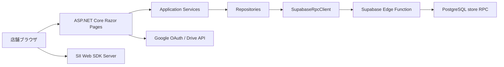
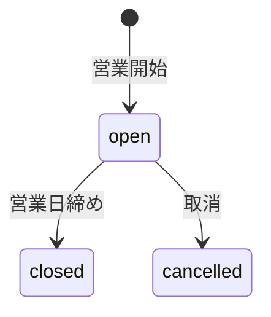
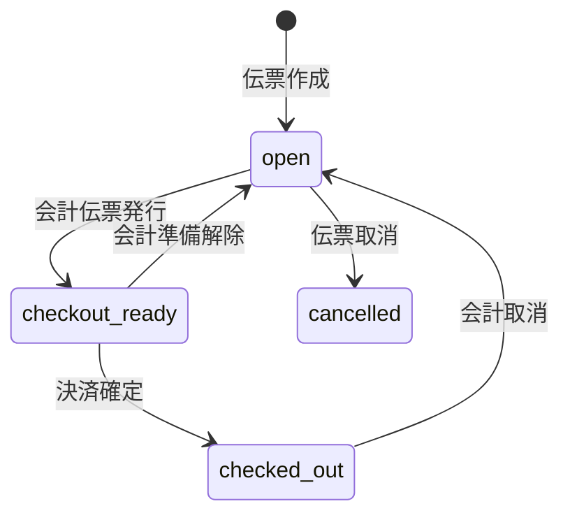

# ProsperApp システム仕様書

最終更新日: 2026-08-22

対象: ProsperApp 現行実装（レビュー環境を含む）

## 1. 文書の目的

本書は、ProsperApp のシステム構成、実行方式、認証・認可、画面、データ、RPC、外部連携、環境差分を定義する。

秘密値、接続先URLの実値、デプロイ資格情報、環境構築手順、開発作業メモは記載しない。

## 2. システム概要

ProsperApp は ASP.NET Core Razor Pages で実装された店舗営業管理Webアプリである。ブラウザからの操作をASP.NET Coreアプリが受け付け、業務データはSupabase Edge Functionを経由してPostgreSQL RPCへ読み書きする。



アプリは業務テーブルへ直接SQLを発行しない。Edge Functionが許可した `store.*` 関数だけを、専用DBロールで実行する。

## 3. 実行技術

| 区分 | 仕様 |
| --- | --- |
| Webフレームワーク | ASP.NET Core Razor Pages |
| ターゲット | .NET `net10.0` |
| 認証 | Cookie認証、Google OAuth、レビュー環境限定ReviewAuth |
| DB | Supabase PostgreSQL |
| DB接続境界 | Supabase Edge Function `prosper-rpc` |
| Edge実行環境 | Supabase Edge Functions |
| 外部API | Google Drive API v3 |
| 印刷 | SII Web SDK Server |
| サーバーキャッシュ | ASP.NET Core MemoryCache |
| クライアント保存 | Cookie、localStorage、IndexedDB |
| ホスティング | Azure App Service |

## 4. 環境構成

### 4.1 本番環境

- 本番用App Serviceと本番用Supabaseを使用する。
- 通常のGoogle OAuth認証を使用する。
- ReviewAuthを有効化しない。
- プリンタ設定は本番端末要件に従う。

### 4.2 レビュー環境

- 本番とは別のApp ServiceとSupabaseを使用する。
- アプリ機能はReviewAuthを除いて同時点の本番コードと同じにする。
- `Staging` 環境として実行し、テスト環境バナーを表示する。
- ReviewAuthを利用できるが、ReviewAuth利用者もテストDBの利用者・店舗権限へ結び付ける。
- DB、Edge Function、APIキー、ReviewAuthトークンを本番と共有しない。
- Staging既定ではブラウザプリンタ連携を無効にする。

## 5. 主要設定

| 設定 | 用途 |
| --- | --- |
| `ASPNETCORE_ENVIRONMENT` | 実行環境の選択 |
| `App:EnabledFeatures` | 機能フラグ |
| `App:EnvironmentBanner` | 非本番環境の識別表示 |
| `Supabase:Url` | SupabaseプロジェクトURL |
| `Supabase:RpcProxyFunctionName` | Edge Function名 |
| `SUPABASE_RPC_EDGE_FUNCTION_URL` | Edge Function URLの環境変数指定 |
| `Supabase_Edge_Key` | Edge要求署名に使う秘密値 |
| `GoogleDrive:ClientId` | Google OAuthクライアントID |
| `GoogleDrive:ClientSecret` | Google OAuthクライアントシークレット |
| `ReceiptPrinter:Enabled` | プリンタ連携の有効化 |
| `ReceiptPrinter:BrowserSdkScriptUrl` | SII Web SDKスクリプト |
| `ReceiptPrinter:BrowserWebSocketHost` | ローカル印刷サービスhost |
| `ReceiptPrinter:LineWidth` | 印字行幅 |
| `ReviewAuth:Enabled` | ReviewAuthの有効化 |
| `ReviewAuth:Token` | ReviewAuthトークン |
| `ReviewAuth:Email` | ReviewAuth利用者メール |
| `ReviewAuth:DisplayName` | ReviewAuth表示名 |
| `ReviewAuth:CookieHours` | ReviewAuth Cookie有効時間 |

秘密値はホスティング環境またはSupabase secretsで管理し、設定ファイルへ保存しない。

## 6. 認証・認可

### 6.1 Google OAuth

1. `/Login` がGoogle OAuth challengeを開始する。
2. `openid`、`profile`、`email`、Drive読み取り専用scopeを要求する。
3. Googleが返す確認済みメールとsubjectを取得する。
4. Edge Function経由で `store.bind_app_user_access` を呼ぶ。
5. `store.app_users` と `store.app_user_department_access` から店舗権限を取得する。
6. メール、subject、許可店舗、既定店舗、店舗別ロールをCookie principalへ格納する。

登録されていない利用者、無効な利用者、店舗権限を持たない利用者は拒否する。Google subjectは初回認証時に登録メールへ結び付け、以後異なるsubjectへの置換を許可しない。

### 6.2 ReviewAuth

1. ReviewAuth設定が完全な場合だけ `/review-login` を有効にする。
2. トークンは固定時間比較で照合する。
3. ReviewAuthのメールと専用subjectを `store.bind_app_user_access` へ渡す。
4. テストDBが返した店舗権限とロールをCookie principalへ格納する。
5. Cookie有効時間は1時間から24時間の範囲へ制限する。

ReviewAuthは認証開始方法だけを置き換える。ログイン後のRPC署名、利用者認可、店舗認可、管理者認可は通常ログインと同じ経路を使う。

### 6.3 現在店舗とロール

- principalの店舗claimから利用可能店舗を決定する。
- 端末Cookieの優先店舗が許可範囲内なら採用する。
- それ以外は既定店舗claim、続いて許可店舗の先頭を使用する。
- 店舗別ロールは `operator` または `administrator` とする。
- 管理者モードは管理者ロールかつサーバーSessionが有効な場合だけ成立する。

### 6.4 Cookieとセッション

- 認証CookieはHttpOnly、Secure、SameSite=Laxとする。
- 通常認証Cookieは90日、sliding expirationを使用する。
- Sessionのidle timeoutは30分とする。
- ログアウト時はSessionを消去して認証Cookieを破棄する。
- リダイレクト先はローカルURLだけを許可する。

## 7. 機能フラグ

| フラグ | 主な対象 |
| --- | --- |
| `Opening` | 営業中、店舗マスタ、表示設定 |
| `Slips` | 伝票作成・編集 |
| `Orders` | 注文端末 |
| `Checkout` | 会計準備、決済、取消、印刷 |
| `Closing` | 勤怠、酒代、締め、日報、売上調整 |
| `SalesHistory` | 売上履歴、過去営業日補正 |
| `Receipts` | 領収書ワークキュー、Driveプレビュー |
| `Settings` | 管理者設定 |

ページとハンドラは利用前に対応フラグを確認し、無効な場合はNotFoundを返す。

## 8. ルート

| ルート | 役割 |
| --- | --- |
| `/Login` | Googleログイン開始、認証エラー表示 |
| `/review-login` | レビュー環境限定ログイン |
| `/logout` | Sessionと認証Cookieの破棄 |
| `/` | 営業中、勤怠、伝票、会計 |
| `/Orders` | 注文端末 |
| `/Closing` | 締めダッシュボード、勤怠、酒代、各種調整、日報 |
| `/Closing/Receipts` | 領収書ワークキュー |
| `/SalesHistory` | 売上履歴、過去営業日補正、日報 |
| `/Management` | 店舗マスタメニュー、表示設定、キャッシュ管理 |
| `/Management/Tables` | 卓番管理 |
| `/Management/Casts` | キャスト管理 |
| `/Management/Staffs` | スタッフ管理 |
| `/Management/Items` | 商品カテゴリ・商品管理 |
| `/Management/NominationBacks` | 指名バック管理 |
| `/Management/Pricing` | 時間料金管理 |
| `/Settings` | 利用店舗、管理者モード、非マスタデータ削除 |
| `/DrivePreview/{driveFileId}` | 許可済み領収書証憑のinline表示 |

Razor Pagesは `/Login` を除き認証必須とする。Driveプレビューとlogout endpointも認証を必須とする。

## 9. サーバーアプリケーション構成

### 9.1 Application Services

| コンポーネント | 役割 |
| --- | --- |
| `IBusinessHomeApplicationService` | 営業中shell、伝票、会計操作の調停 |
| `IAttendanceApplicationService` | 勤怠読込・保存、営業日開始 |
| `IOrderEntryApplicationService` | 注文候補取得、注文登録 |
| `IClosingApplicationService` | 締めダッシュボード、営業日締め |
| `IDailyReportApplicationService` | 現在・過去営業日の日報取得 |
| `ISalesHistoryApplicationService` | 売上履歴、補正エディタ、補正保存 |
| `IStoreMasterBootstrapper` | 営業画面用マスタbootstrap |
| `IManagementMasterSynchronization` | 店舗マスタsnapshotとmutation |

### 9.2 Repositories

Repositoryは業務領域ごとにRPC payloadと結果を型へ変換する。

- 店舗設定・マスタ
- 営業日・勤怠
- 伝票・営業中同期
- 注文
- 会計
- 締め・酒代・ドリンクバック・キャスト売上額
- 日報・売上履歴
- 領収書

RepositoryはHTTPやSQLの詳細をPageModelへ露出しない。

### 9.3 SupabaseRpcClient

- Edge Function URLと署名キーを設定から解決する。
- principalからメールとGoogle subjectを取り出し、actor envelopeへ付与する。
- JSON本文に対してHMAC-SHA256署名を生成する。
- UNIX時刻と署名を専用HTTP headerへ設定する。
- 読み取りRPCだけを限定的に再試行する。
- status、duration、operation ID、request IDを構造化ログへ記録する。
- Edge応答の `data` または `result` を正規化してRepositoryへ返す。

## 10. ブラウザ同期

### 10.1 営業中

- Razor GETは画面shellを返す。
- マスタキャッシュがcoldの場合だけbootstrap RPCでマスタと同時点snapshotを取得する。
- warmの場合はブラウザがcurrent snapshotを取得する。
- focus、online、定期更新の重複要求をsingle-flightで統合する。
- 伝票編集操作はlocalStorageへ下書き保存し、楽観反映後に一括flushする。

### 10.2 注文端末

- 現在営業日の `open` 伝票と商品候補を取得する。
- 注文キューを店舗・営業日単位でlocalStorageへ保持する。
- 一括登録はoperation ID付きで送信し、confirmed応答後にキューを更新する。

### 10.3 領収書

- resume cursor付きのワークキューを取得する。
- 入力結果をIndexedDB outboxへ保持する。
- 先頭操作をoperation ID付きで送信し、結果不明時は同じIDで再送する。

## 11. データモデル

### 11.1 認証・権限

| テーブル | 役割 |
| --- | --- |
| `store.app_users` | 正規化メール、Google subject、有効状態 |
| `store.app_user_department_access` | 店舗部門、ロール、既定店舗 |

認証テーブルは `store` schemaに置き、公開ロールから直接参照できない。

### 11.2 マスタ

| 区分 | 主なテーブル |
| --- | --- |
| 会社・店舗 | `company_master`, `department_master`, `store_table_master` |
| 人員 | `cast_master`, `store_staff_master` |
| 商品 | `store_item_category_master`, `store_item_master` |
| 料金・バック | `store_pricing_plan_master`, `store_nomination_back_master` |
| 決済 | `payment_method_master` |

### 11.3 営業データ

| 区分 | 主なテーブル |
| --- | --- |
| 営業日 | `store_business_days` |
| 勤怠 | `store_cast_attendance`, `store_staff_attendance` |
| 伝票 | `store_slips`, `store_slip_customers`, `store_slip_casts` |
| 注文 | `store_order_lines`, `store_order_line_cast_backs` |
| 料金 | `store_slip_charge_lines`, `store_slip_pricing_lines` |
| バック | `store_slip_cast_backs`, `store_business_day_drink_back_adjustments` |

### 11.4 会計・締め・経費

| 区分 | 主なテーブル |
| --- | --- |
| 会計 | `store_checkouts`, `store_checkout_payments` |
| 会計固定 | `store_slip_accounting_snapshots` |
| キャスト売上額 | `store_slip_cast_sales_adjustments` |
| 営業日締め固定 | `store_business_day_closing_snapshots` |
| 領収書経費 | `store_business_day_receipt_expenses` |
| 会計連携 | `accounting.documents`, `accounting.journal_entries`, `accounting.journal_entry_lines` |

### 11.5 冪等操作

次のテーブルでoperation ID、payload hash、結果を保持する。

- `store.business_home_sync_results`
- `store.current_business_day_operation_results`
- `store.management_master_operation_results`
- `store.receipt_work_queue_operations`

## 12. 状態遷移

### 12.1 営業日



`closed` 後は対象営業日の主要業務テーブル更新をDB triggerで拒否する。

### 12.2 伝票



- `open`: 営業中編集と注文追加が可能。
- `checkout_ready`: 会計金額と印字データを固定済み。
- `checked_out`: 決済確定済み。

## 13. RPC境界

### 13.1 要求形式

通常RPCは次の情報を署名対象JSONとして送る。

```json
{
  "operation": "rpc",
  "actor": {
    "email": "authenticated-user",
    "google_subject": "authenticated-subject"
  },
  "function_name": "store.some_function",
  "payload": {}
}
```

認証開始時のaccess bindは専用operationを使用する。

### 13.2 Edge Function検証

- POST以外を拒否する。
- 署名時刻の許容範囲を検証する。
- HMAC署名を固定時間で検証する。
- allowlistにない関数を拒否する。
- 関数ごとに引数名と型を正規化する。
- actorのメールとsubjectから店舗権限を検証する。
- 管理者操作ではadministratorロールを要求する。
- DBエラーは公開可能なエラーコードへ正規化する。

### 13.3 主なRPC群

| 領域 | 主なRPC |
| --- | --- |
| 認証 | `bind_app_user_access` |
| 店舗 | `get_departments` |
| 営業中 | `get_business_home_bootstrap_v2`, `get_current_business_home_snapshot`, `sync_business_home_changes_v2` |
| 注文 | `get_current_order_entry_candidates`, `submit_current_order_entry_v2` |
| 勤怠 | `get_attendance_editor_bootstrap_v2`, `get_current_attendance_editor_snapshot`, `save_current_business_day_attendance_v2` |
| 会計 | `issue_checkout_statement_v2`, `release_checkout_ready_v2`, `confirm_checkout_v2`, `cancel_checkout_v2` |
| 締め | `get_current_closing_dashboard`, `close_business_day_v2` |
| 調整 | `get_current_drink_back_editor`, `save_drink_back_adjustments_v2`, `save_current_cast_sales_adjustment_v2` |
| 日報・履歴 | `get_business_day_daily_report`, `get_sales_history_page`, `save_sales_history_correction_v1` |
| 領収書 | `get_current_receipt_work_queue`, `advance_receipt_work_queue_v2`, `is_pending_receipt_drive_file_allowed` |
| マスタ | `get_management_master_snapshot`, `save_management_master_v2` |

## 14. 主要業務フロー

### 14.1 伝票作成・編集

1. ブラウザが卓番、入店時刻、顧客、指名を検証する。
2. 操作を端末下書きへ保存して画面へ楽観反映する。
3. `sync_business_home_changes_v2` へバッチ送信する。
4. DBが営業日、revision、卓番、出勤状態、伝票状態を再検証する。
5. 操作別結果と最新snapshotを返す。

### 14.2 会計

1. `issue_checkout_statement_v2` が時間料金と会計明細を計算する。
2. 会計スナップショットと印字データを固定する。
3. 伝票を `checkout_ready` にする。
4. `confirm_checkout_v2` が固定合計と決済入力を照合する。
5. 決済確定後に領収書印字データを返す。

### 14.3 営業日締め

1. `get_current_closing_dashboard` で全締め条件を取得する。
2. ブラウザは条件達成時だけ通常締めを有効化する。
3. `close_business_day_v2` が同一transaction内で条件を再確認する。
4. 営業日締めスナップショットを保存する。
5. 営業日を `closed` に更新する。

### 14.4 売上履歴補正

1. 対象営業日の補正editorを取得する。
2. 利用者が勤怠、ドリンクバック、キャスト売上額を編集する。
3. actorメール、現在営業日、operation IDとともに補正RPCへ送る。
4. DBが対象日、revision、金額整合性を検証して補正結果を返す。

## 15. 時間・料金

- 店舗時刻は日本時間を基準とする。
- 営業日の境界は12:00とする。
- 正午前の時刻は営業日上の翌暦日として合成する。
- 画面では深夜時刻を24時以降表記にできる。
- 時間料金はDBで計算する。
- 営業中の見込み額は現在時刻、会計準備は指定退店時刻を基準にする。
- 会計準備後の自動料金は固定済み明細として扱う。

## 16. キャッシュ

| キャッシュ | 有効期間 | 対象 |
| --- | --- | --- |
| サーバーマスタ | 明示削除・更新まで | 店舗、卓番、キャスト、スタッフ、商品、料金、決済方法 |
| サーバーruntime | 30秒 | 営業中の短期状態 |
| Driveファイル | 10分 | 許可済み証憑metadata・media |
| browser SyncStore | revision更新まで | 画面マスタ、直近read model |
| browser outbox | confirmedまで | 未確定command |

営業日、伝票、締め状態などのruntimeデータは長期マスタキャッシュへ保存しない。

## 17. 外部連携

### 17.1 Google Drive

- OAuth access tokenは認証propertiesへ保存する。
- Drive scopeは読み取り専用へ固定する。
- DBが未処理領収書への紐付きを許可したファイルだけを取得する。
- metadata取得後にmediaを取得し、inlineで返す。
- access token不足時はGoogle再認証へ誘導する。

### 17.2 SII Web SDK Server

- ブラウザからローカルWebSocket hostへ接続する。
- 会計伝票と領収書のコマンド列を生成する。
- SDK URL、host、コードページ、国際文字、行幅、ロゴ条件を設定で変更できる。
- 無効環境では印刷要求を実行しない。

## 18. セキュリティ

- HTTPS redirectと非Development環境のHSTSを有効にする。
- 全画面を認証必須にする。
- CSP nonceを生成し、許可されたscriptだけを実行する。
- `X-Content-Type-Options: nosniff`、`X-Frame-Options: SAMEORIGIN`、referrer policyを設定する。
- Edge Function要求を時刻付きHMAC署名で保護する。
- `store` schemaと専用関数を公開ロールからrevokeする。
- 専用DBロールにはallowlist関数の実行に必要な最小権限だけを付与する。
- `security definer` 関数は固定 `search_path` を使用する。
- 締め済み更新禁止と重要整合性をDB制約・triggerで保証する。

## 19. エラー処理・ログ

- Application ServiceとRepositoryは成功、入力不正、競合、権限不足、未設定、外部障害を区別する。
- Page handlerは失敗種別に応じて400、403、404、409、503等を返す。
- Edge Functionはrequest IDと安定したerror codeを返す。
- SupabaseRpcClientは関数名、operation ID、HTTP status、処理時間、request IDを記録する。
- Google Drive障害はrequest ID付きで画面へ返し、秘密情報や生DBエラーを表示しない。

## 20. テスト契約

自動テストは次を検証対象とする。

- C#のRPC呼出名、Edge Function allowlist、SQL関数定義の一致。
- actor署名、access bind、店舗権限、管理者権限の契約。
- `security definer`、固定 `search_path`、公開ロールからの権限剥奪。
- 営業中同期、注文、勤怠、会計、締め、領収書、売上履歴の冪等性と状態遷移。
- 会計スナップショット、営業日締めスナップショット、締め後更新禁止。
- 主要画面、テーマ、モーダル、印刷レイアウト、端末下書きのUI契約。
- ReviewAuthがテストDBの利用者権限を経由すること。

## 21. 公開情報の範囲

本リポジトリで公開する製品文書は、本書と「要件定義書」だけとする。秘密値、環境構築手順、設計メモ、実装調査、作業引継ぎ、Codex向け指示は公開対象に含めない。
