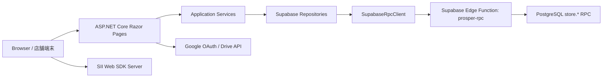
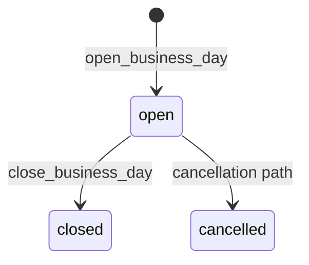
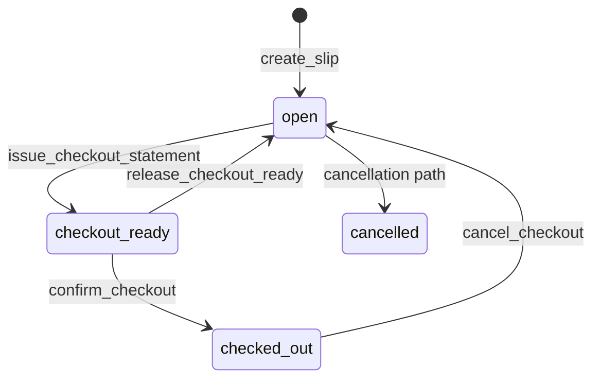

# ProsperApp システム仕様書

作成日: 2026-07-30

対象: 現行 `main` 実装を正とした ProsperApp のシステム構成、画面、アプリケーションサービス、DB/RPC、外部連携、運用仕様。

注記:

- 本書はコード、SQL、Edge Function、画面実装、契約テストから確認できる現行仕様を整理したもの。
- 秘密値、接続先URL、APIキー、publish profile の内容は記載しない。

## 1. システム概要

ProsperApp は ASP.NET Core Razor Pages で構成された店舗営業管理アプリである。ブラウザから Razor Pages にアクセスし、アプリケーションサービスが Repository を通じて Supabase Edge Function `prosper-rpc` を呼び出す。Edge Function は許可済み PostgreSQL RPC だけを実行する。



## 2. 実行基盤

- フレームワーク: ASP.NET Core Razor Pages
- ターゲット: .NET `net10.0`
- 認証: Cookie 認証、Google OAuth
- DB 接続境界: Supabase Edge Function 経由の PostgreSQL RPC
- 外部API: Google Drive API v3
- 印刷: SII Web SDK Server
- クライアント保存: Cookie、localStorage、Session
- キャッシュ: ASP.NET Core MemoryCache

## 3. 主要設定

| 設定 | 用途 |
| --- | --- |
| `App:EnabledFeatures` | 機能フラグ制御 |
| `Supabase:Url` | Supabase プロジェクト URL |
| `Supabase:RpcEdgeFunctionUrl` | RPC Edge Function の明示URL |
| `Supabase:RpcProxyFunctionName` | Edge Function 名。既定は `prosper-rpc` |
| `Supabase:StoreDepartmentId` | 端末設定がない場合の店舗部門ID |
| `Supabase:PendingStatus` | 未処理領収書ステータス |
| `Supabase:CompletedStatus` | 領収書入力済みステータス |
| `Supabase:ScanMistakeStatus` | スキャンミス除外ステータス |
| `GoogleDrive:ClientId` | Google OAuth クライアントID |
| `GoogleDrive:ClientSecret` | Google OAuth クライアントシークレット |
| `GoogleDrive:Scopes` | Google Drive API スコープ |
| `GoogleAuth:AllowedEmails` | 許可メールアドレス |
| `GoogleAuth:AllowedDomains` | 許可ドメイン |
| `ReceiptPrinter:Enabled` | ブラウザプリンタ連携の有効化 |
| `ReceiptPrinter:BrowserSdkScriptUrl` | SII Web SDK のスクリプトURL |
| `ReceiptPrinter:BrowserWebSocketHost` | SII Web SDK Server の host |
| `ReceiptPrinter:BrowserCodePage` | 印字コードページ |
| `ReceiptPrinter:LineWidth` | 印字行幅 |

Supabase RPC キーは環境変数または設定から取得する。値は秘密情報として扱う。

## 4. 認証・セッション仕様

- `MapRazorPages().RequireAuthorization()` により、ログイン画面を除く Razor Pages は認証必須である。
- Google OAuth 設定がある場合、未ログイン時の challenge は Google を利用する。
- Google OAuth 設定がない場合は Cookie 認証のみで動作する。
- Google ログイン成功時に access token を保存し、Google Drive プレビューで利用する。
- Google 認証では許可メールまたは許可ドメインを必須とし、未許可ユーザーは認証チケット作成時または Principal 検証時に拒否する。
- ログアウト時は Session と Cookie を破棄する。
- ログイン後リダイレクトはローカルURLだけを許可する。
- 管理者設定は固定パスワードと保存トークンで保護し、管理者モードはサーバー側 Session にだけ保持する。商品カテゴリ操作と締め条件無視のPOSTは管理者モードを再検証する。

## 5. 機能フラグ

| 機能名 | 主な対象 |
| --- | --- |
| `Opening` | 営業中、店舗設定導線 |
| `Slips` | 伝票作成 |
| `Orders` | 注文端末 |
| `Checkout` | 会計、決済、領収書印字 |
| `Closing` | 勤怠、酒代、締め、キャスト売上額調整 |
| `Receipts` | 領収書簡易入力、Drive 証憑プレビュー |
| `Settings` | 管理者設定 |

無効な機能のページは NotFound とする。

## 6. ルート仕様

| ルート | 主な PageModel | 概要 |
| --- | --- | --- |
| `/Login` | `LoginModel` | Google ログイン、設定エラー表示 |
| `/logout` | logout handler | Session と Cookie を破棄 |
| `/Index` | `IndexModel` | 営業中、伝票作成、営業中編集、会計 |
| `/Attendance` | `AttendanceModel` | 営業中導線の勤怠入力 |
| `/Orders/Index` | `Orders.IndexModel` | 注文端末 |
| `/Closing/Index` | `Closing.IndexModel` | 締め前 readiness と営業日締め |
| `/Closing/Attendance` | `AttendanceModel` | 締め導線の勤怠入力 |
| `/Closing/DrinkCost` | `DrinkCostModel` | 酒代入力 |
| `/Closing/ChampagneBacks` | `ClosingChampagneBacksModel` | シャンパン追加バック入力 |
| `/Closing/Receipts` | `ReceiptsModel` | 領収書簡易入力 |
| `/DrivePreview/{driveFileId}` | `DrivePreviewModel` | Drive 証憑プレビュー |
| `/Closing/CastSalesAdjustment` | `CastSalesAdjustmentModel` | キャスト売上額調整 |
| `/Management/Index` | `Management.IndexModel` | 店舗設定メニュー、端末の画面モード・配色設定 |
| `/Management/Tables` | `TablesModel` | 卓番管理 |
| `/Management/Casts` | `CastsModel` | キャスト管理 |
| `/Management/Items` | `ItemsModel` | 商品カテゴリ・商品管理 |
| `/Management/NominationBacks` | `NominationBacksModel` | 指名バック管理 |
| `/Management/Pricing` | `PricingModel` | 時間料金管理 |
| `/Settings/Index` | `SettingsModel` | 利用店舗・管理者モード設定、キャッシュ、デバッグ削除 |

`/Attendance` は `/Closing/Attendance` にもマップされる。

## 7. アプリケーション層

| コンポーネント | 役割 |
| --- | --- |
| `IBusinessHomeApplicationService` | 営業中画面の初期ロード、営業日スナップショット、伝票作成、会計系操作 |
| `IAttendanceApplicationService` | 勤怠画面ロード、勤怠保存、営業日の自動作成 |
| `IClosingApplicationService` | 締め画面ロード、readiness 取得、営業日締め |
| `IOrderEntryApplicationService` | 注文端末ロード、伝票選択肢取得、注文登録 |
| `IOrderQueueService` | 注文キューの入力復元と検証補助 |
| `ILocalSettingsProvider` | Cookie から端末設定を復元 |
| `IFeatureGate` | 機能フラグ判定 |
| `IStoreClock` | 店舗営業日と時刻表示の計算 |
| `IApplicationCache` | MemoryCache とキャッシュ状態表示 |
| `ISupabaseRpcClient` | Edge Function RPC 呼び出し |
| `IGoogleDriveAuthService` | Google 認証設定、access token 取得 |
| `IDriveFileService` | Drive metadata/media 取得 |

Repository は Supabase RPC を通じて、店舗文脈、マスタ、営業日、伝票、注文、会計、締め、領収書、キャスト売上額調整を取得・保存する。

## 8. データモデル概要

### 8.1 マスタ

| 区分 | 主なテーブル |
| --- | --- |
| 店舗 | `store_department_master`, `store_table_master` |
| キャスト | `cast_master` |
| 商品 | `store_item_category_master`, `store_item_master` |
| 指名バック | `store_nomination_back_master` |
| 決済方法 | `payment_method_master` |
| 時間料金 | `store_pricing_plan_master` |

卓番と標準商品は物理削除できるため、伝票・注文明細側は削除可能マスタへのFKを持たず、IDと表示用snapshotを保持する。注文明細は商品名・単価に加えてカテゴリID・コード・名称も注文時に固定する。商品カテゴリは配下商品がない場合だけ物理削除できる。

### 8.2 営業中データ

| 区分 | 主なテーブル |
| --- | --- |
| 営業日 | `store_business_days` |
| 勤怠 | `store_cast_attendance` |
| 伝票 | `store_slips` |
| 顧客 | `store_slip_customers` |
| 指名 | `store_slip_casts` |
| 注文 | `store_order_lines`, `store_order_line_cast_backs` |
| 自由入力・自動料金 | `store_slip_charge_lines`, `store_slip_pricing_lines` |
| キャストバック | `store_order_line_cast_backs`, `store_slip_cast_backs`, `store_business_day_champagne_backs` |

### 8.3 会計・締め

| 区分 | 主なテーブル |
| --- | --- |
| 会計 | `store_checkouts`, `store_checkout_payments` |
| 会計固定 | `store_slip_accounting_snapshots` |
| キャスト売上額調整 | `store_slip_cast_sales_adjustments` |
| 営業日締め固定 | `store_business_day_closing_snapshots` |

## 9. 状態遷移

### 9.1 営業日



- `closed` 後の営業日データ更新は DB トリガで拒否する。
- `close_business_day` は readiness を再確認し、条件未達の場合は失敗する。ただし管理者モードの締め条件無視ではこの条件確認を省略できる。

### 9.2 伝票



- `open` のみ営業中編集と注文追加を許可する。
- `checkout_ready` は会計金額と印字データを固定した状態である。
- `checked_out` は決済確定済みである。

## 10. RPC 境界

C# アプリは `ISupabaseRpcClient` で以下の形式を Edge Function に POST する。

```json
{
  "function_name": "store.some_function",
  "payload": {
    "p_department_id": 1
  }
}
```

Edge Function は allowlist 済みの `store.*` 関数のみを実行する。代表的な RPC は以下である。

### 10.1 設定・店舗

- `store.get_departments`
- `store.delete_non_master_records`
- `store.get_context`

### 10.2 営業日・締め

- `store.get_current_business_day`
- `store.open_business_day`
- `store.open_business_day_with_attendance`
- `store.save_business_day_attendance`
- `store.get_open_slip_count`
- `store.get_business_day_drink_delivery_status`
- `store.save_business_day_drink_delivery_amount`
- `store.get_business_day_closing_attendance`
- `store.save_business_day_closing_attendance`
- `store.get_business_day_champagne_back_overview`
- `store.save_business_day_champagne_backs`
- `store.get_business_day_closing_readiness`
- `store.close_business_day`

### 10.3 マスタ

- `store.get_tables`
- `store.get_table_admin_list`
- `store.upsert_table`
- `store.delete_table`
- `store.get_casts`
- `store.get_casts_admin`
- `store.create_cast`
- `store.update_cast_drink_memo`
- `store.delete_cast`
- `store.get_order_entry_slips`
- `store.get_order_items`
- `store.get_item_admin_catalog`
- `store.upsert_item_category`
- `store.delete_item_category`
- `store.upsert_item`
- `store.delete_item`
- `store.reorder_items`
- `store.get_nomination_back_master`
- `store.save_nomination_back_master`
- `store.get_pricing_plan`
- `store.save_pricing_plan`
- `store.get_payment_methods`

### 10.4 営業中・注文

- `store.create_slip`
- `store.get_business_day_snapshot`
- `store.flush_business_home_changes`
- `store.get_order_attending_casts`
- `store.add_order_lines`

### 10.5 会計・領収書

- `store.issue_checkout_statement`
- `store.get_checkout_statement_print_data`
- `store.release_checkout_ready`
- `store.confirm_checkout`
- `store.get_checkout_receipt_print_data`
- `store.cancel_checkout`
- `store.get_pending_receipts`
- `store.quick_enter_receipt`
- `store.mark_receipt_scan_mistake`

### 10.6 キャスト売上額調整

- `store.get_business_day_cast_sales_adjustment_overview`
- `store.get_business_day_cast_sales_adjustment_status`
- `store.get_cast_sales_adjustment_slips`
- `store.get_cast_sales_adjustment_detail`
- `store.save_cast_sales_adjustment`
- `store.save_business_day_cast_sales_adjustments`

SQL 内部ヘルパーには、時間料金計算、会計スナップショット作成、営業日締めスナップショット作成、締め後更新ガードなどがある。これらは Edge Function allowlist 経由で直接呼ばず、RPC または DB トリガから利用する。

## 11. 主要処理フロー

### 11.1 営業中画面ロード

1. 端末設定から店舗部門IDを決定する。
2. 店舗文脈、現在営業日、卓番、指名設定、注文商品、決済方法を取得する。
3. 必要に応じて出勤キャストを取得する。
4. 現在営業日がある場合、営業日スナップショットを取得する。
5. 画面は定期更新と手動更新でスナップショットを再取得する。

### 11.2 伝票作成

1. 利用者が卓番、入店時刻、顧客、指名、メモを入力する。
2. PageModel が入力値、店舗文脈、営業日、出勤キャスト、指名設定を検証する。
3. `store.create_slip` を呼び出す。
4. 作成成功後、営業中画面を再表示する。

### 11.3 営業中編集 flush

1. クライアントは顧客、指名、注文、自由入力明細、カラオケの操作を localStorage に保存する。
2. 操作は画面上で楽観反映する。
3. `client_batch_id` と操作配列を `OnPostFlushBusinessHomeChangesAsync` に送る。
4. サーバーは操作内容を検証し、`store.flush_business_home_changes` を呼ぶ。
5. RPC は操作単位の結果と新しいスナップショットを返す。
6. クライアントは成功分を確定し、失敗分を画面上で扱う。

### 11.4 注文端末登録

1. 注文端末は現在営業日の open 伝票を取得する。
2. 利用者が伝票と商品を選び、注文キューへ追加する。
3. バック対象商品ではキャスト指定を受け付ける。
4. キューは localStorage に保存する。
5. 一括登録時に入力を検証し、`store.add_order_lines` を呼ぶ。
6. 登録成功後、端末キューを破棄する。

### 11.5 会計

1. `open` 伝票で退店時刻を選択する。
2. `store.issue_checkout_statement` が時間料金と会計明細を計算し、会計スナップショットを固定する。
3. 伝票は `checkout_ready` になる。
4. クライアントは会計伝票を印刷する。
5. 決済確定時は決済方法と金額を検証し、`store.confirm_checkout` を呼ぶ。
6. 確定後、領収書印字データを使って領収書を印刷する。

### 11.6 締め

1. 締め画面は現在営業日の readiness を取得する。
2. readiness は未会計、酒代、勤怠、キャスト売上額調整、シャンパン追加バック、未処理領収書を確認する。
3. 条件達成時だけ営業日締めボタンを有効化する。
4. `store.close_business_day` は readiness を再確認する。
5. 締め成功時に営業日締めスナップショットを保存し、営業日を `closed` にする。
6. DB トリガにより締め後更新を拒否する。

### 11.7 領収書簡易入力

1. 未処理領収書をステータスで取得する。
2. Drive ファイルがある場合、許可対象のファイルだけをプレビューする。
3. 利用者が支払日、金額、科目、摘要を入力する。
4. 仕訳 payload を生成し、`store.quick_enter_receipt` を呼ぶ。
5. スキャンミスの場合は `store.mark_receipt_scan_mistake` を呼ぶ。

## 12. 時間・営業日仕様

- 店舗時刻は日本時間を基準とする。
- 営業日の切替は 12:00 とする。
- 12:00 より前の実時刻は前営業日に属する。
- 営業日上の時刻入力では、12:00 より前の時刻を翌暦日として合成する。
- 画面表示では深夜帯を 24 時以降表記にできる。
- 入力候補は店舗文脈の分単位に従う。未設定または不正な場合は既定値を使う。

## 13. 時間料金仕様

- 料金プランは `set_extension_v1` を扱う。
- セット時間は 5 から 480 分で管理する。
- セット料金と延長料金は、1名時料金と複数名時の人数単価を持つ。
- 有効な料金プランがない場合、自動時間料金は発生しない。
- 時間料金は DB 側で計算する。
- 営業中の見込みでは現在時刻を基準に計算する。
- 会計伝票発行時は指定された退店時刻を基準に固定する。
- 固定された自動料金は `automatic_pricing` 明細として扱う。

## 14. 印刷仕様

### 14.1 会計伝票

- SII Web SDK Server を使って印刷する。
- 卓番、入店時刻、退店時刻、人数、注文、調整、指名料、時間料金、税額、合計を出力する。
- 商品種別は、セット料金、延長料金、指名料、カラオケ、その他の順序で扱う。
- 会計伝票印刷に失敗した場合、`checkout_ready` の伝票から印字データを再取得できる。

### 14.2 領収書

- SII Web SDK Server を使って印刷する。
- 店舗情報、宛名、但し書き、合計、税額、決済方法を出力する。
- 再印刷時は再発行扱いの情報を付与する。
- 一定金額以上の場合は収入印紙欄を出力する。
- 印刷失敗時は localStorage の再印刷待ちに保存する。

## 15. キャッシュ仕様

| キャッシュ | 期間 | 主な対象 |
| --- | --- | --- |
| マスタ | 更新時まで | 店舗文脈、卓番、キャスト、スタッフ、商品、商品管理カタログ、料金、指名バック、決済方法 |
| 実行時 | 30 秒 | 現在営業日、出勤キャスト、注文対象、営業中関連状態 |
| Drive プレビュー | 10 分 | Drive metadata/media |
| 未処理領収書 | 30 秒 | 領収書一覧 |

`store.get_store_bootstrap` は全マスタと営業中トップ用snapshotをまとめて返す。マスタ更新時は関連キャッシュとbootstrap payloadを削除する。アプリ内キャッシュの一覧・全削除は店舗設定画面の最下部で行う。

## 16. エラー処理

- Repository は成功、未設定、権限不足、利用不可などを `Result<T>` として返す。
- Supabase 未設定または RPC 利用不可の場合、画面は読み込み問題として表示する。
- 保存系ハンドラは検証エラー、競合、外部サービス不可を適切な HTTP ステータスまたは画面エラーで返す。
- Google Drive 認証が必要な場合はログインへ誘導する。
- 営業中 flush の部分失敗は、操作単位の結果としてクライアントに返す。

## 17. セキュリティ仕様

- Razor Pages は認証必須である。
- Google 認証は許可メールまたは許可ドメインを必須にする。
- RPC Edge Function は API キー allowlist と HTTP method を検証する。
- Edge Function は allowlist に存在する `store.*` 関数だけを実行する。
- PostgreSQL の公開ロールから `store` schema の usage/execute を revoke する。
- アプリが使う RPC は `security definer` と固定 `search_path` を持つ。
- 締め後の更新禁止は DB トリガで保証する。
- ローカルリダイレクト以外の戻り先は許可しない。

## 18. 契約テスト・検証対象

現行テストでは主に以下を検査する。

- C# の RPC 呼び出し名、Edge Function allowlist、SQL 定義の一致。
- RPC の `security definer`、固定 `search_path`、公開ロールへの execute revoke。
- 会計スナップショットの作成、取得、解除、取消の契約。
- 時間料金プランと自動料金計算の契約。
- 注文端末の下書き保存と伝票状態変化時のキュー整理。
- 営業中の下書き保存、楽観更新、UI契約。
- 決済 UI の金額一致、受取額、0円会計の契約。
- 領収書レイアウト、会計伝票レイアウト、モーダルスクロール位置、テーマ契約。
